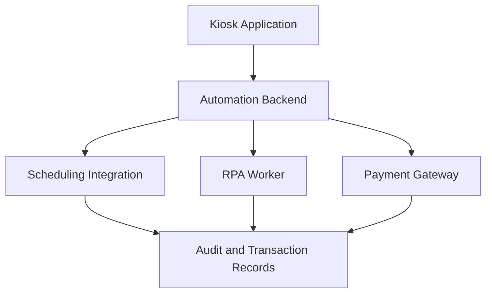
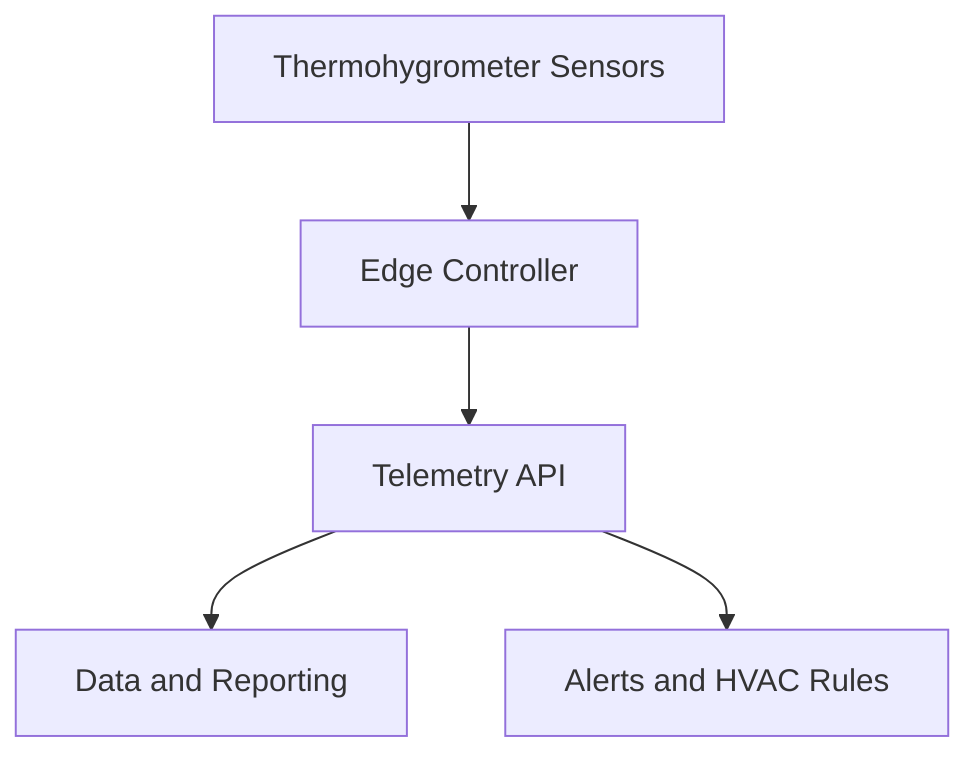
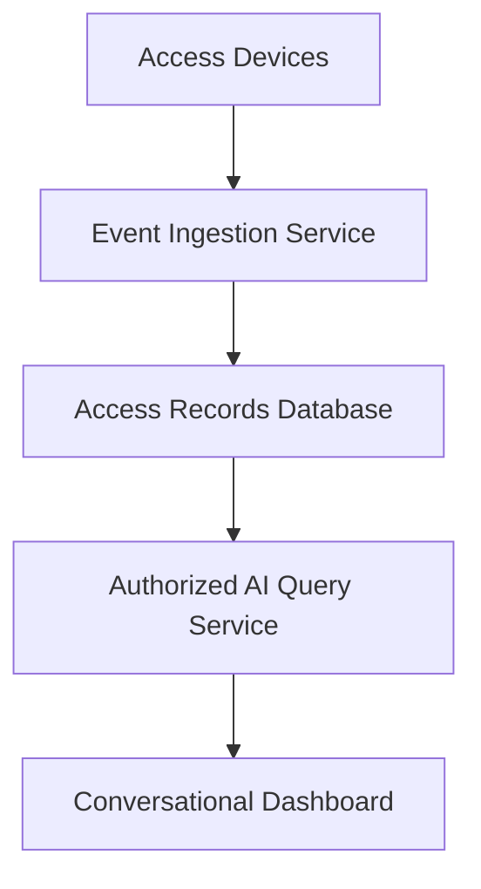

# Backend Automation, IoT & AI Engineering Portfolio

Professional engineering case studies by **Luis David Ducuara Cadavid**, Backend & Automation Developer and Mechatronics Engineering student.

These case studies summarize work developed at Ingeniot S.A.S. at a portfolio-appropriate level. Client names, proprietary source code, production endpoints, credentials, personal data, contractual figures, and confidential implementation details are intentionally excluded.

## Case Study 1: Healthcare Self-Service Kiosk Automation

### Challenge

High-volume service locations depend on several disconnected systems for appointment validation, arrival confirmation, payment collection, and transaction evidence. Repetitive manual steps can create queues and make end-to-end traceability difficult.

### Solution

A self-service workflow that coordinates authorized APIs, RPA actions, payment integrations, webhooks, and transactional records from a patient-facing kiosk.

### Main capabilities

- Same-day appointment validation through an authorized API.
- Automated arrival confirmation in a legacy operational system.
- Retrieval of applicable service fees.
- QR-based payment initiation.
- Webhook processing for payment confirmation.
- Receipt and transaction evidence generation.
- Workflow states, retries, timeouts, and assisted fallback paths.

### My contribution

- Backend and automation design with NestJS, Node.js, Python, and n8n.
- REST API, webhook, RPA, and payment gateway integrations.
- PostgreSQL transaction tracking and operational traceability.
- Dockerized services and AWS-based components.
- Technical coordination of a four-person development team.

### Technology profile

`NestJS` · `Node.js` · `Python` · `n8n` · `PostgreSQL` · `REST APIs` · `Webhooks` · `RPA` · `Docker` · `AWS`

---

## Case Study 2: Environmental Monitoring and HVAC Automation

### Challenge

Distributed facilities require continuous temperature and humidity supervision in operationally sensitive areas. Manual checks provide limited coverage and make it difficult to react quickly or evaluate environmental and energy patterns.

### Solution

An IoT monitoring platform that captures thermohygrometer measurements at regular intervals, centralizes telemetry, produces alerts and reports, and supports automated HVAC control rules.

### Main capabilities

- Continuous temperature and humidity monitoring.
- Five-minute telemetry collection intervals.
- Multi-location device visibility.
- Threshold and device-status alerts.
- Historical reports and traceability.
- Scheduled and condition-based HVAC automation.
- Safe behavior during connectivity or sensor failures.

### My contribution

- IoT architecture and component integration.
- Backend services for telemetry, alerts, device status, and reporting.
- Control rules based on schedules and environmental thresholds.
- Field implementation planning and technical documentation.
- Evaluation of operational and energy-efficiency opportunities.

### Technology profile

`IoT Sensors` · `Edge Computing` · `Embedded Controllers` · `Backend APIs` · `PostgreSQL` · `Cloud Services` · `Automation Rules`

---

## Case Study 3: Access Control Analytics with Natural-Language AI

### Challenge

Access-control platforms generate large volumes of event records. Operational teams often need technical database knowledge or manually built reports to answer simple questions about entries, exits, schedules, devices, and unusual activity.

### Solution

A conversational analytics layer that allows authorized users to ask operational questions in natural language and receive structured answers based on access-control records.

### Example questions

- How many access events were recorded today?
- Which time ranges had the highest entry volume?
- Which devices reported communication problems?
- Show access activity for an authorized date range.
- Summarize unusual operational patterns for review.

### Engineering considerations

- Role-based access to queries and results.
- Read-only, validated database operations.
- Restricted query scope and parameterized filters.
- Audit trail for prompts, generated queries, and responses.
- Protection of identity and access-event information.
- Clear separation between AI-generated summaries and verified source records.

### Technology profile

`Python` · `NestJS` · `SQL/PostgreSQL` · `LLM APIs` · `REST APIs` · `Access Control Integration` · `Audit Logging`

---

## Core engineering strengths

| Area | Demonstrated experience |
| --- | --- |
| Backend | APIs, microservices, validation, integration services |
| Automation | n8n, RPA, webhooks, stateful workflows |
| Data | PostgreSQL, telemetry, transactions, audit trails |
| Cloud | AWS Lambda, API Gateway, RDS, event-driven services |
| IoT | Sensors, edge controllers, alerts, actuator integration |
| AI | Natural-language operational queries and controlled data access |
| Leadership | Technical planning and coordination of a four-person team |

## Confidentiality and security

This repository contains architectural summaries only. It does not contain production code, real patient or employee data, biometric information, API credentials, functional QR codes, internal URLs, or customer-specific documentation.

## Visual documentation

Sanitized screenshots and diagrams will be added after removing names, identifiers, appointments, access records, URLs, QR codes, and third-party confidential branding.

## Related public projects

- [Employability Platform](https://github.com/LuisDa87/Empleabilidad)
- [TechHelpDesk API](https://github.com/LuisDa87/prueba-nest)
- [Financial Operations Dashboard](https://github.com/LuisDa87/financiera)

## Contact

[GitHub](https://github.com/LuisDa87) · [LinkedIn](https://www.linkedin.com/in/luisdavidd/)
